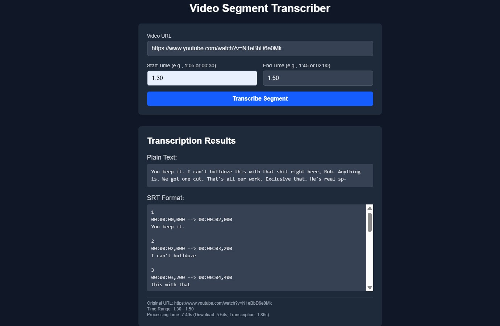

# Video Segment Transcriber App

This project is a web application designed to transcribe specific segments of online videos (like YouTube). Users provide a video URL and a start/end time range. The backend downloads the relevant audio segment, transcribes it using OpenAI's Whisper model, and returns the transcription in both plain text and SRT format.

## Screenshot



## Features Implemented

*   **Frontend UI:** Simple, clean interface built with Next.js and Tailwind CSS for entering video URL and time range.
*   **Backend API:** Robust API built with FastAPI (Python) to handle transcription requests.
*   **Video Segment Download:** Uses `yt-dlp` and `ffmpeg` to efficiently download and extract audio only for the specified time range from various web sources.
*   **Audio Transcription:** Leverages the `openai-whisper` library (currently using the `base` model) for accurate speech-to-text conversion.
*   **SRT Generation:** Converts Whisper's timestamped segments into standard SRT subtitle format using custom line-breaking logic.
*   **Plain Text Output:** Provides the full transcription as plain text.
*   **Redis Caching:** Caches successful transcription results (keyed by URL, time range, and options) in Redis to avoid reprocessing identical requests, significantly speeding up subsequent requests.
*   **CORS Handling:** Configured FastAPI backend to allow requests from the frontend origin during development.
*   **Containerization:** Dockerfiles provided for both the Next.js frontend and FastAPI backend for consistent environments.
*   **Local Orchestration:** Uses Docker Compose (`docker-compose.yml`) to easily build and run the entire application stack (frontend, backend, Redis) locally with a single command.
*   **Basic Error Handling:** Implemented error handling for download failures, API errors, and Redis connectivity issues.
*   **Analysis Placeholders:** Added endpoint flags and placeholder functions for future text analysis features (Sentiment, POS tagging, Word Frequency, Topic).

## Technology Stack

*   **Frontend:**
    *   Framework: Next.js (v14+) with App Router
    *   Language: TypeScript
    *   Styling: Tailwind CSS
    *   State Management: React Hooks (`useState`)
*   **Backend:**
    *   Framework: FastAPI
    *   Language: Python (3.10+)
    *   Data Validation: Pydantic
    *   Server: Uvicorn
*   **Transcription:** OpenAI Whisper (`base` model)
*   **Video/Audio Processing:** yt-dlp, FFmpeg
*   **Caching:** Redis
*   **Containerization:** Docker, Docker Compose
*   **Development Environment:** WSL2 (Ubuntu 22.04) on Windows

## Project Structure

```text
.
├── backend/ # FastAPI application code
│ ├── Dockerfile # Docker instructions for backend
│ ├── .dockerignore # Files to ignore for backend Docker build
│ ├── main.py # FastAPI app entrypoint, endpoints
│ ├── requirements.txt # Python dependencies
│ ├── schemas.py # Pydantic models for API requests/responses
│ ├── utils.py # Helper functions (e.g., SRT conversion)
│ └── temp_audio/ # Temporary storage (ignored by git & docker)
│
├── frontend/
│ └── web-transcriber/ # Next.js application code (adjust if name differs)
│ ├── Dockerfile # Docker instructions for frontend
│ ├── .dockerignore # Files to ignore for frontend Docker build
│ ├── next.config.ts # Next.js configuration (standalone output enabled)
│ ├── package.json # Node dependencies and scripts
│ ├── tsconfig.json # TypeScript configuration (path aliases)
│ ├── tailwind.config.ts# Tailwind CSS configuration
│ ├── .eslintrc.json # ESLint configuration
│ ├── public/ # Static assets
│ └── src/ # Source code
│ ├── app/ # Next.js App Router structure
│ │ ├── page.tsx # Main page component
│ │ └── components/ # React components (e.g., TranscriptionForm)
│
├── docker-compose.yml # Docker Compose configuration for local stack
├── README.md # This file
└── .gitignore # Git ignore rules for the whole project

```


## Local Setup and Running (Docker Compose)

These instructions assume you have Docker Desktop installed and running with WSL2 integration enabled for your Ubuntu distribution.

1.  **Clone the Repository:**
    ```bash
    git clone
    ```

2.  **Navigate to Project Root:** Ensure your terminal (running in WSL Ubuntu) is in the project's root directory (where `docker-compose.yml` is located).

3.  **Build Docker Images:**
    ```bash
    docker compose build
    ```
    

4.  **Run the Application Stack:**
    ```bash
    docker compose up -d
    ```
    *(This starts the frontend, backend, and Redis containers in detached mode.)*

5.  **Verify Services:**
    ```bash
    docker compose ps
    ```
    *(Check that all three services: `backend`, `frontend`, `redis_service` are listed and running.)*

6.  **Access the Application:** Open your web browser and navigate to:
    `http://localhost:3000`

7.  **View Logs (Optional):**
    ```bash
    docker compose logs -f          # View logs from all services
    
    ```
8.  **Stopping the Application:**
    ```bash
    docker compose down
    ```

## Key Decisions & Trade-offs

*   **Monorepo:** Chose a single repository for frontend and backend for simpler initial setup, atomic commits across concerns, and potentially easier type sharing. Trade-off: Can become large; requires disciplined structure.
*   **FastAPI (Backend):** Chosen for performance (async), automatic docs (Swagger), Python's ML ecosystem (Whisper, yt-dlp), and ease of use. Trade-off: Less "batteries-included" than Django for things like ORMs or admin panels (not needed here).
*   **Next.js (Frontend):** Chosen for its robust React framework features, App Router, SSR/SSG capabilities (though primarily CSR used initially), TypeScript support, and good developer experience. Trade-off: Can be more complex than simpler React setups (like Vite+React) for basic apps.
*   **Whisper Model:** Started with `base` model for faster processing and lower resource usage, suitable for local dev and potential free tiers. Trade-off: Less accurate than larger models (`small`, `medium`, `large`).
*   **yt-dlp Post-processing:** Using `ffmpeg` via `postprocessor_args` (`-ss`, `-to`) for precise segment extraction instead of relying solely on yt-dlp's potentially less accurate download sections feature. Trade-off: Requires `ffmpeg` installation.
*   **Redis Caching:** Implemented simple caching based on request parameters. Trade-off: Cache key includes all options; more sophisticated caching (e.g., hashing) could be used. Using basic `SETEX` for expiration.
*   **Docker Compose (Local):** Used for orchestrating the multi-container setup locally. Trade-off: Not a full production orchestration system like Kubernetes, but excellent for development and basic deployments.
*   **Synchronous Whisper Call:** Currently, the `/transcribe` endpoint blocks while Whisper runs. Trade-off: Simple implementation, but limits concurrency and responsiveness for long transcriptions. Future enhancement: Move to async task execution.
*   **Next.js Standalone Output:** Configured for smaller, optimized production Docker images.

## Future Enhancements / Next Steps

*   [ ] **Testing:** Implement unit and integration tests for backend (FastAPI, transcription logic) and frontend (React components, API calls).
*   [ ] **AWS Setup:** Configure AWS account, IAM user/roles, and S3 bucket for potential file storage.
*   [ ] **CI/CD Pipeline:** Create GitHub Actions workflows to automate testing, linting, Docker image builds, and pushing images to a registry (e.g., AWS ECR).
*   [ ] **ECS Deployment:** Define AWS ECS Task Definitions and Services to deploy the containerized application. Use Fargate for serverless compute.
*   [ ] **ElastiCache:** Replace the Docker Compose Redis service with AWS ElastiCache (Redis compatible) in the cloud environment.
*   [ ] **UI Refinements:** Improve loading states, add light/dark theme toggle, enhance error display, potentially add progress indication.
*   [ ] **Async Backend Tasks:** Refactor the transcription process to run asynchronously (e.g., using FastAPI's `BackgroundTasks` for longer tasks, `asyncio.to_thread`, or a dedicated task queue like Celery) to prevent blocking the API server.
*   [ ] **Analysis Implementation:** Implement the actual logic for sentiment analysis, POS tagging, word frequency, and topic modeling using relevant Python libraries (spaCy, NLTK, Transformers, etc.).
*   [ ] **Configuration Management:** Move hardcoded values (like model name, Redis details) to environment variables managed properly through Docker Compose overrides or ECS task definition environment variables/secrets.
*   [ ] **HTTPS:** Ensure secure communication in production deployment.
*   [ ] **Monitoring & Logging:** Integrate more robust logging and monitoring solutions in the cloud environment.
